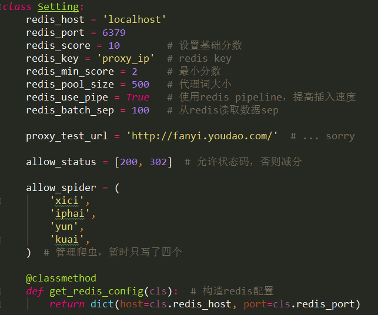
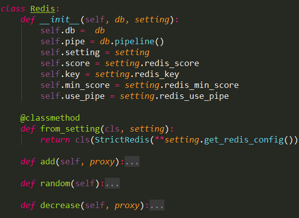
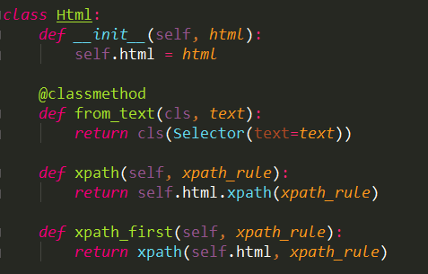
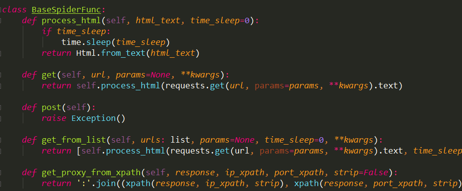
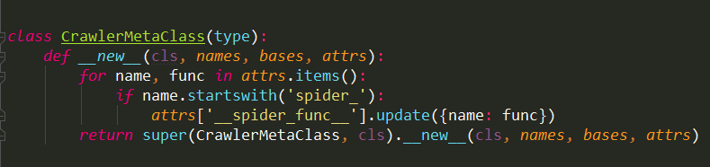
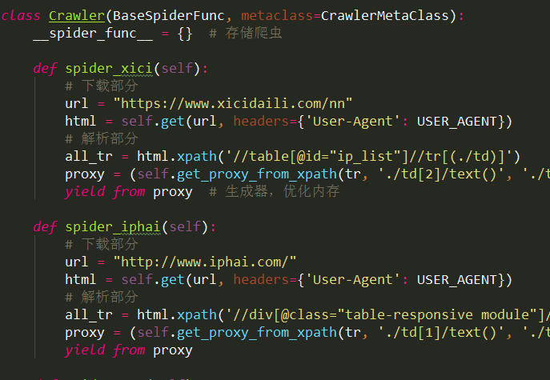
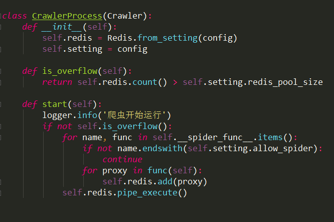
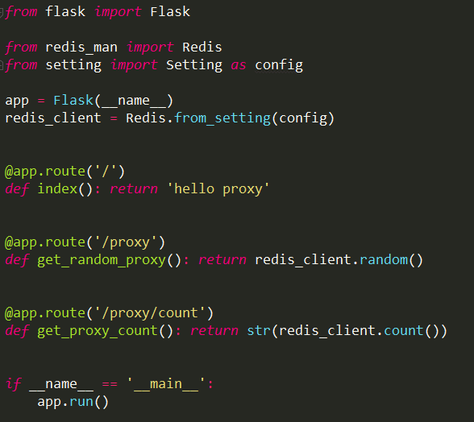

##### 前言

github上代理获取的项目很多，作者写的可能也不是很好。此项目偏向于学习吧，
若是有所收获，不妨 give me star ~

## 项目介绍

通过爬虫，爬取免费IP代理来构建代理池。并定时check代理IP活性，进行打分删选与清除。
最后通过flask编写简易api提供代理接口服务。并确保相关三方包已安装。

### 流程：

爬虫获取数据 -> 数据入库 -> 检查数据活性 -> 接口服务
***
下载代码后，可使用pycharm打开项目，将proxy_pool及父目录均加载为sources_root，不然可能会出现导包路径加载异常的问题。

所需三方包：

scrapy      >= 1.6.0

requests    >= 2.21.0

redis       >= 2.10.6

flask       >= 1.0.2

数据库： redis
***
* 执行指令顺序

python command.py spider

python command.py checker

python command.py api

spider为运行爬虫，checker为检查代理活性，api为启动接口

若需要将日志输出到文件，可以追加 --log 参数，如：

python command.py spider --log

### 代码：

### 1、setting模块



setting中，包含对redis的基础设置，还有代理池的基本设置。
其中我们允许的状态码有200和302。
编写的爬虫嘛，暂时只有4个。


### 2、Redis模块



其实就是初始化redis数据库，然后自定一些基础方法，如插入数据、随机获取、数据减分等等。

此处插入数据库使用了pipeline管道，插入速度应该会快一些。配置开关也可以在setting里面设置。


### 3、Spider模块

主要分为以下类

* Html

调用from_text函数，以requests返回的DOM文本作为输入，通过scrapy的Selector构建选择器。提供基本的xpath筛选功能。



* BaseSpiderFunc

此类定义有主要的下载逻辑，也包含有spider的基础功能。



* CrawlerMetaClass

爬虫元类，主要目的是用来扫描并收集所定义的爬虫。

扫描的规则为：以"spider_"为开头命名的函数，为了优化内存，此函数定义为生成器。



* Crawler

爬虫模块，定义有目标爬虫。举两个例子。

下图中我们可以看到爬虫分为下载部分与解析部分。

下载部分调用基础功能模块中的方法get获取DOM。解析部分则调用相关函数解析出代理proxy，此处是一个生成器。



* CrawlerProcess

爬虫执行管理模块。初始化时即定义了redis类，在start函数中，判断是否超过设定代理池size，但是只有首次检测，后序插入数据若足够大，还是会超过设定大小的。emmmm，算了，感觉也行。其余就是一些插入功能了。

但需要注意的是，在使用了pipeline时，执行self.redis.add函数，数据没有插入数据库，实际插入是在执行pipe_execute之后，才会一起插入。




### 4、Check模块

check模块采用了异步框架asyncio、aiohttp等。（笔记本好窄，截图截不到=-=）

```
class Checker:
    def __init__(self):
        self.redis = Redis.from_setting(config)
        self.setting = config

    async def check(self, proxy, flag=0):
        async with sem:  # 设定异步并发大小
            conn = aiohttp.TCPConnector(ssl=False)
            async with aiohttp.ClientSession(connector=conn) as session:
                try:
                    http_proxy = 'http://' + proxy.decode()
                    async with session.get(self.setting.proxy_test_url,
                                           timeout=1,
                                           allow_redirects=False,
                                           proxy=http_proxy) as response:
                        if response.status in self.setting.allow_status:
                            flag = 1
                except:
                    pass
                if not flag:
                    self.redis.decrease(proxy)

    def start(self, start=0):
        count = self.redis.count()
        sep = min(count // 4, self.setting.redis_batch_sep)  # 获取最小sep
        loop = asyncio.get_event_loop()
        for i in range(0, count, sep):
            if i == 0:
                continue
            stop = i
            proxy_pool = self.redis.batch(start, stop)
            tasks = [self.check(proxy) for proxy in proxy_pool]
            loop.run_until_complete(asyncio.wait(tasks))
            start = stop
        loop.close()
```

### 5、api接口

这个就没啥好说了，咱也不懂，咱就会用，还就那么一点=-=


